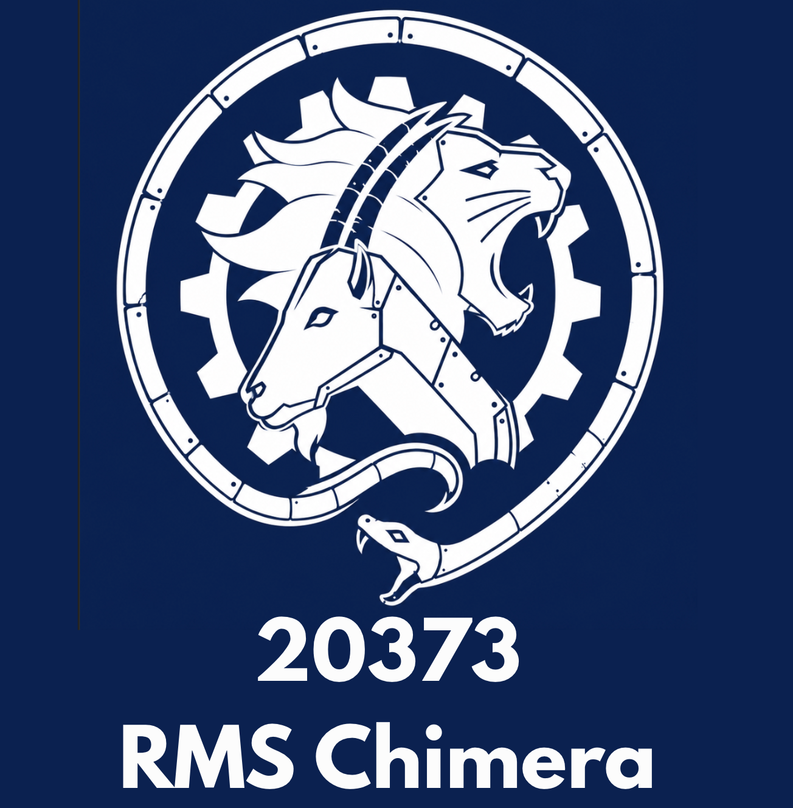
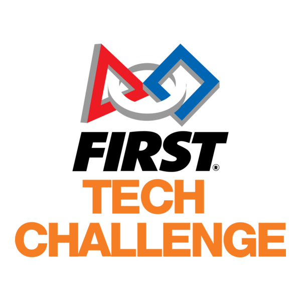

# FIRST Tech Challenge Team *20373 RMS Chimera*'s OFFICIAL GITHUB PAGE :fire: :+1:

We are an FTC Team based in Saratoga, CA, and compete in the NorCal region.

## Check out our popular repos
[Testing-Quickstart](https://github.com/FTChimera/Testing-Quickstart)   Our quickstart for Android Studio's Unit testing feature, for FTC!\
[Chimera-Decode-25-26](https://github.com/FTChimera/Chimera-Decode-25-26)   Our Android Studio Project containing all the code for the 2025-26 DECODE season.\
[Centerstage-code](https://github.com/FTChimera/CenterStage-code)   Our Android Studio TeamCode folder containing all the code for the 2023-24 CenterStage season.\
[Power-Play-Code](https://github.com/FTChimera/Power-Play-Code)  All of our Java classes used in the 2022-23 Power Play season.\
[20373-Freight-Frenzy-Code](https://github.com/FTChimera/20373-Freight-Frenzy-Code)   All our Java classes used for the 2021-22 Freight Frenzy season.

### Check out our website and youtube channel!

<!--[20373-Biobuzz-26-27](https://github.com/FTChimera/20373-Chimera-Biobuzz-26-27)   Our Android Studio Project containing all the code for the 2026-27 BioBuzz season.\ -->
<!--
**FTChimera/FTChimera** is a ✨ _special_ ✨ repository because its `README.md` (this file) appears on your GitHub profile.

Here are some ideas to get you started:

- 🔭 I’m currently working on ...
- 🌱 I’m currently learning ...
- 👯 I’m looking to collaborate on ...
- 🤔 I’m looking for help with ...
- 💬 Ask me about ...
- 📫 How to reach me: ...
- 😄 Pronouns: ...
- ⚡ Fun fact: ...
-->
